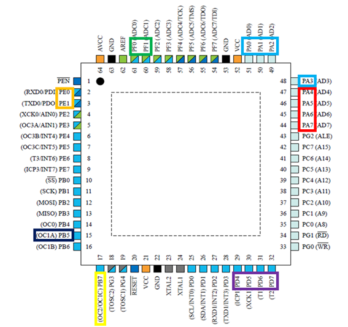

# Atmega128A_Control

# 개요

- Uart 시리얼 통신을 사용하여 피에조 부저 멜로디 출력, Step Motor 회전 방향 설정과 부저와 Motor의 현재 상태를 CLCD에 출력하여 실시간으로 보여주고, 프로그램이 구동되는 동안 Cds 센서를 이용하여 빛의 밝기에 따라 LED 의 밝기를 변화 시키는 기능을 하나의 MCU로 제어하는 프로그램 입니다.

- LED 밝기는 Cds가 측정하는 빛의 밝기가 어두워 질 수록 LED는 밝아지는 식으로 구현하였습니다.

# 시스템 설계

> ## 주변 장치와 Pin 연결 구조

- Red

  - PA4 ~ PA7 : CLCD Module D4 ~ D7 
   
- Skyblue

  - P0 : CLCD Module RS
  
  - P1 : CLCD Module RW
  
  - P2 : CLCD Module E

- Green

  - PF0 : Sensor Module CDS_OUT
  
  - PF1 : Sensor Module CDS_IN

- Orange

  - PE0 : UART Module RXD0
  
  - PE1 : UART Module TXD0

- Blue

  - PB5 : LED Module LED4

- Yellow

  - PB7 : Audio Module PIEZO

- Purple

  - PD4 ~ PD7 : Step Motor
  
  
> ## 실제 장비 연결 이미지

# 개발 환경

- OS : Windows 7 Professional K 64bit

- Language : C Code

- CPU : Intel(R) Core(TM) i7-4790 CPU @ 3.60GHz

- RAM : 8GB

- IDE : Atmel Studio 7.0

# 구동 영상 URL

[바로 가기](https://youtu.be/PBA-aTZwOjw)

# 추후 개선사항

- 자동 처리 기능과 Cds를 하나더 추가하여 특정 버튼을 입력 받으면 활성화 되어 두 개의 Cds 일조량을 비교하여 모터를 제어해 해바라기 처럼 해를 따라가는 형식의 태양광 발전기를 구현 할 수 있을 것이다.

- 하이퍼 터미널로 키를 입력하면 약간의 타임 렉이 발생하는데, main 함수 내의 Delay와 타이머 제어 구를 조절하여 타임 렉을 줄일 필요가 있다.
